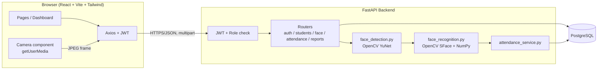
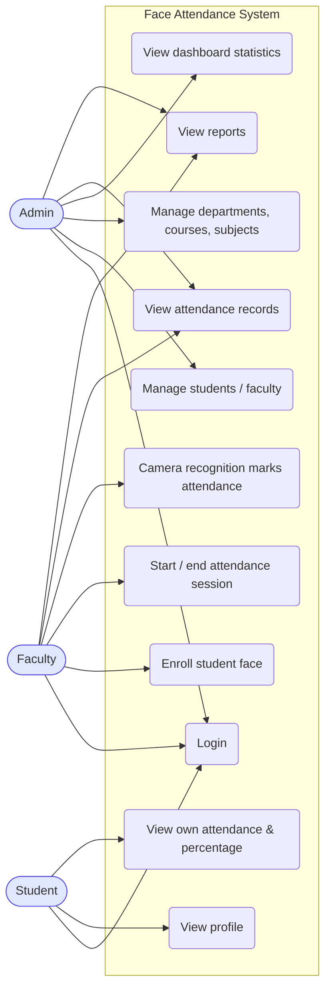
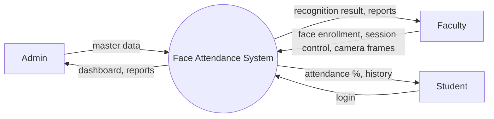
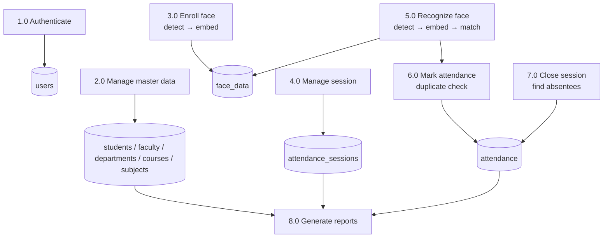

# Facial Recognition-Based Automated Students Attendance Monitoring System
### Project Documentation (Mini Project)

> Diagrams are written in Mermaid. They render in VS Code (Markdown Preview Mermaid Support extension), GitHub, or paste the code into <https://mermaid.live> and export as PNG for your report.

---

## 1. Abstract
Taking attendance manually consumes class time, is prone to errors and allows proxy attendance. This project presents a web-based **Facial Recognition-Based Automated Students Attendance Monitoring System**. The administrator registers students, faculty, departments, courses and subjects. Faculty enroll each student's face through a webcam; the system stores a numerical *face embedding* rather than the photograph. During a class the faculty starts an attendance session and the browser camera streams frames to a FastAPI backend, where OpenCV detects faces and compares their embeddings with the enrolled students of that class. Recognised students are marked present automatically with date and time, duplicates are prevented, and students who were not recognised are recorded as absent when the session ends. Daily, monthly, subject-wise and student-wise reports with attendance percentage are provided. The system uses React, FastAPI, PostgreSQL, JWT authentication and OpenCV.

## 2. Problem Statement
Manual roll-call attendance is time-consuming, error-prone, difficult to consolidate into reports, and vulnerable to proxy attendance. Institutions need a simple, automatic and reliable way to record attendance and to generate accurate reports.

## 3. Objectives
1. Automate attendance marking using facial recognition.
2. Reduce the manual work and class time spent on attendance.
3. Prevent duplicate and proxy entries.
4. Store attendance with date, time, subject, faculty and session.
5. Provide role-based access for Admin, Faculty and Student.
6. Generate attendance reports and percentages.
7. Protect data using password hashing, JWT and by storing embeddings instead of photographs.

## 4. Existing System
* Attendance is taken on paper registers or by calling names.
* Time is lost in every class; totals and percentages are calculated by hand.
* Proxy attendance is easy; records may be lost or altered.
* Reports for students/parents need manual effort.
* Biometric fingerprint devices are costly, require contact and queues.

## 5. Proposed System
A web application where the browser camera captures frames, the server detects and recognises faces, and attendance is stored automatically in PostgreSQL. Faculty only start and end a session; students cannot mark their own attendance. Admin manages master data; every role gets its own dashboard and reports.

**Advantages:** contactless, fast, automatic, fewer proxies, instant reports, works with an ordinary webcam.

## 6. Functional Requirements
| ID | Requirement |
|---|---|
| FR1 | Users log in with email and password; JWT is issued; role decides the dashboard. |
| FR2 | Admin manages students, faculty, departments, courses, subjects (add / view / edit / delete / search). |
| FR3 | Student ID and roll number must be unique. |
| FR4 | Faculty enroll a student's face (select student → camera → detect → embedding → store). |
| FR5 | System handles: no face, multiple faces, poor image (small / dark / blurry), invalid camera input. |
| FR6 | Faculty create an attendance session (subject, section, date, start time, status). |
| FR7 | While a session is active the system detects and recognises faces and marks PRESENT automatically. |
| FR8 | A face below the matching threshold is reported as "Student Not Recognized" and nothing is stored. |
| FR9 | A student is never marked twice in one session (backend check + DB unique constraint). |
| FR10 | On closing a session, absent students = all class students − present students, and are stored as ABSENT. |
| FR11 | Reports: daily, monthly, subject-wise, student-wise with attendance percentage. |
| FR12 | Students view profile, attendance history, subject-wise attendance and percentage. |
| FR13 | Admin dashboard shows totals and today's attendance. |

## 7. Non-Functional Requirements
| Category | Requirement |
|---|---|
| Security | bcrypt password hashes, JWT, role checks on every backend route, input validation (Pydantic), CORS, ORM (no raw SQL), embeddings never returned by the API. |
| Performance | One frame is processed in well under a second on an ordinary laptop (frames resized to 640 px, small ONNX models). |
| Usability | Simple dashboard UI, clear on-screen messages, responsive layout. |
| Reliability | DB constraints protect data integrity; errors return clear messages. |
| Maintainability | Layered code: routers → services → models; reusable React components. |
| Portability | Runs on Windows / Linux / macOS; only pip + npm + PostgreSQL required. |
| Privacy | Face photographs are not stored; only 128-value embeddings. |

## 8. System Architecture

**Flow:** React Camera → capture frame → Axios → FastAPI → OpenCV detection → embedding & matching → Attendance service → PostgreSQL.

**Face recognition method.** OpenCV **YuNet** finds the face and its 5 landmarks. The face is aligned and **SFace** converts it into a 128-value embedding. Two faces are compared with *cosine similarity*; a match needs similarity ≥ **0.363** (recommended value for SFace; configurable). During enrollment 3 frames are averaged into one embedding for robustness.

## 9. ER Diagram
```mermaid
erDiagram
    USERS ||--o| STUDENTS : "has profile"
    USERS ||--o| FACULTY : "has profile"
    DEPARTMENTS ||--o{ COURSES : offers
    DEPARTMENTS ||--o{ STUDENTS : has
    DEPARTMENTS ||--o{ FACULTY : has
    DEPARTMENTS ||--o{ SUBJECTS : has
    COURSES ||--o{ STUDENTS : enrolls
    COURSES ||--o{ SUBJECTS : contains
    FACULTY ||--o{ SUBJECTS : teaches
    STUDENTS ||--o| FACE_DATA : "has embedding"
    SUBJECTS ||--o{ ATTENDANCE_SESSIONS : "held for"
    FACULTY ||--o{ ATTENDANCE_SESSIONS : conducts
    ATTENDANCE_SESSIONS ||--o{ ATTENDANCE : records
    STUDENTS ||--o{ ATTENDANCE : "marked in"
    USERS { int id PK string email string password_hash string role bool is_active datetime created_at }
    STUDENTS { int id PK string student_id UK string roll_number UK string name string email string phone int department_id FK int course_id FK int year int semester string section int user_id FK }
    FACULTY { int id PK string faculty_id UK string name string email string phone int department_id FK string designation int user_id FK }
    DEPARTMENTS { int id PK string name UK string code UK text description }
    COURSES { int id PK string name string code UK int department_id FK string duration text description }
    SUBJECTS { int id PK string name string code UK int course_id FK int department_id FK int semester int faculty_id FK }
    FACE_DATA { int id PK int student_id FK_UK bytes face_embedding datetime created_at datetime updated_at }
    ATTENDANCE_SESSIONS { int id PK int subject_id FK int faculty_id FK string section date date time start_time time end_time string status }
    ATTENDANCE { int id PK int session_id FK int student_id FK datetime marked_at string status float recognition_distance }
```

## 10. Use Case Diagram

Students cannot mark their own attendance – only the recognition process started by faculty can.

## 11. Data Flow Diagrams
**Level 0 (context diagram)**

**Level 1**


## 12. Database Schema
| Table | Columns (PK, FK, constraints) |
|---|---|
| **users** | id PK · email UNIQUE · password_hash · role (admin/faculty/student) · is_active · created_at |
| **students** | id PK · student_id UNIQUE · roll_number UNIQUE · name · email · phone · department_id FK · course_id FK · year · semester · section · user_id FK UNIQUE · created_at |
| **faculty** | id PK · faculty_id UNIQUE · name · email · phone · department_id FK · designation · user_id FK UNIQUE · created_at |
| **departments** | id PK · name UNIQUE · code UNIQUE · description |
| **courses** | id PK · name · code UNIQUE · department_id FK · duration · description |
| **subjects** | id PK · name · code UNIQUE · course_id FK · department_id FK · semester · faculty_id FK (nullable) |
| **face_data** | id PK · student_id FK UNIQUE · face_embedding (bytes, 128 × float32) · created_at · updated_at |
| **attendance_sessions** | id PK · subject_id FK · faculty_id FK · section · date · start_time · end_time · status (active/closed) |
| **attendance** | id PK · session_id FK · student_id FK · marked_at · status (PRESENT/ABSENT) · recognition_distance · **UNIQUE(session_id, student_id)** |

*Design note:* `section` is stored on the session (in addition to the fields you specified) because a class is identified as Subject → Course + Semester, plus Section.
`recognition_distance` = 1 − cosine similarity (smaller = better match).

## 13. API Documentation
All routes are prefixed `/api`. Send `Authorization: Bearer <token>` except login. Interactive docs: `/docs`.

| Method | Endpoint | Role | Description |
|---|---|---|---|
| POST | /auth/login | public | `{email, password}` → `{access_token, role}` |
| GET | /auth/me | any | Current user (name, role, profile_id) |
| POST/GET | /students | admin (GET: admin, faculty) | Create / list (`?search=&department_id=&course_id=&semester=&section=`) |
| GET | /students/{id} | admin, faculty, student (own only) | One student |
| PUT/DELETE | /students/{id} | admin | Edit / delete |
| POST/GET | /faculty | admin | Create / list |
| PUT/DELETE | /faculty/{id} | admin | Edit / delete |
| POST/PUT/DELETE | /departments, /courses, /subjects (`/{id}`) | admin | Manage |
| GET | /departments, /courses | any | List |
| GET | /subjects | any | Admin: all · Faculty: own · Student: own course & semester |
| POST | /face/detect | admin, faculty | Live "face detected?" check (image) |
| POST | /face/enroll/{student_id} | admin, faculty | Multipart `images[]` → embedding stored |
| GET | /face/status/{student_id} | admin, faculty | `{enrolled, updated_at}` |
| DELETE | /face/{student_id} | admin, faculty | Delete face data |
| POST | /attendance/session | faculty | `{subject_id, section}` → start (or resume) session |
| POST | /attendance/recognize | faculty | Multipart `session_id`, `image` → recognises & marks |
| POST | /attendance/session/{id}/close | faculty | End session, store absentees, return summary |
| GET | /attendance/session/{id} | admin, faculty | Details with present & absent lists |
| GET | /attendance/sessions | admin, faculty | List sessions (`?date=&subject_id=&status=`) |
| GET | /reports/daily | admin, faculty | `?date=&subject_id=` |
| GET | /reports/monthly | admin, faculty | `?year=&month=&subject_id=` |
| GET | /reports/subject/{subject_id} | admin, faculty | Student-wise totals for a subject |
| GET | /reports/student/{student_id} | admin, faculty, student (own only) | Subject-wise + history |
| GET | /reports/dashboard | admin | Totals + today's attendance |

**Example – recognition response**
```json
{
  "message": "John Mathew marked PRESENT",
  "present_count": 1, "total_students": 2,
  "faces": [{
    "box": {"x": 0.31, "y": 0.22, "w": 0.24, "h": 0.36},
    "recognized": true, "status": "PRESENT",
    "student": {"id": 1, "student_id": "S001", "roll_number": "MCA001", "name": "John Mathew"},
    "time": "09:15:32", "distance": 0.31
  }]
}
```

**Attendance percentage** = (Present Classes ÷ Total Classes) × 100 — e.g. 18 ÷ 20 × 100 = 90 %. Only *closed* sessions count.

## 14. Testing
Automated: `cd backend && pip install pytest httpx && pytest -q` runs an end-to-end API test (uses SQLite and a stand-in face engine, so it needs no camera or PostgreSQL). It covers logins, role protection, student CRUD and uniqueness, enrollment errors, session start, recognition, duplicate prevention, unknown face, session close, absent detection, all reports and deletion rules.

Manual test cases (with the real camera):

| # | Test | Steps | Expected result |
|---|---|---|---|
| 1 | Admin login | admin@college.edu / Admin@123 | Admin dashboard opens |
| 2 | Faculty login | faculty@college.edu / Faculty@123 | Faculty dashboard opens |
| 3 | Student login | john@college.edu / Student@123 | Student dashboard opens |
| 4 | Wrong password | any wrong password | "Invalid email or password" |
| 5 | Role protection | Student opens `/admin` | Redirected to `/student`; API returns 403 |
| 6 | Student registration | Admin → Add student | Row appears; duplicate ID/roll/email gives error |
| 7 | Face enrollment | Faculty → select student → capture | "Face enrolled", badge turns Enrolled |
| 8 | No face | Cover the camera | "No face detected" |
| 9 | Multiple faces | Two people in view during enrollment | "Multiple faces detected" |
| 10 | Poor image | Dark room / blur | "Image too dark" / "Poor image quality" |
| 11 | Recognition | Start session, show enrolled face | Student marked PRESENT with time |
| 12 | Unknown face | Show an unenrolled person | "Student Not Recognized", no record |
| 13 | Duplicate prevention | Show same face again | "already marked", present count unchanged |
| 14 | Absent detection | End session | Remaining class students stored ABSENT and listed |
| 15 | Closed session | Recognize after closing | Error "session is closed" |
| 16 | Reports | Daily / Monthly / Subject / Student | Correct totals and percentages |
| 17 | Student view | Login as student | Only own attendance visible |

## 15. Screenshots (capture these for your report)
1. Login page  2. Admin dashboard  3. Students list + Add student modal  4. Faculty / Departments / Courses / Subjects pages
5. Faculty dashboard  6. Face Enrollment with green face box  7. Attendance session with camera + PRESENT panel
8. Session summary (present/absent lists)  9. Attendance Records  10. Reports (daily, monthly, subject, student)
11. Student dashboard with subject-wise percentages  12. Swagger `/docs` page  13. PostgreSQL tables in pgAdmin

## 16. Future Enhancements
* **Liveness / anti-spoofing** (blink or depth check) to stop photo/video attacks.
* Mobile app and multi-camera classroom mode.
* Email / SMS alerts when attendance falls below 75 %.
* Export reports to PDF / Excel; timetable integration to auto-open sessions.
* Face-model upgrades (larger models, GPU), automatic re-enrollment when appearance changes.
* Manual correction workflow with an audit log; institution-wide analytics.

## 17. Conclusion
The system replaces manual roll-call with automatic, contactless attendance. Using OpenCV embeddings, JWT-secured role-based access, PostgreSQL constraints and a clean React interface, it saves class time, reduces proxy attendance and gives instant, accurate reports. It is simple enough to demonstrate in a few minutes while following real-world practices such as password hashing, layered architecture and privacy-friendly storage of biometric data. With liveness detection and further tuning it can grow into a production-ready solution.
